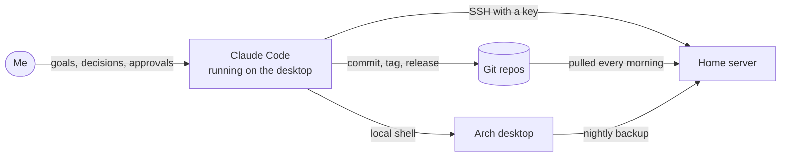

# claude-code-homelab

## An Arch desktop and a home server, built with an AI agent that measures before it answers

Since August 2026 I've built and run two Linux machines with
[Claude Code](https://claude.com/claude-code): a gaming desktop on Arch, and a
home server on a second-hand ThinkPad. This repo is the write-up: what exists,
how the work gets done, the real problems along the way, and the mistakes. The
working repos stay private because they map my home network. Everything here
comes from them and is current as of 2026-10-04.



## What got built

**The desktop.** Arch Linux on CachyOS's kernel and repos, KDE Plasma on
Wayland, an RTX 5070 Ti. One script reinstalls it from the Arch USB. Every
night it snapshots the system and backs up `/home` to the server, and it only
updates if both of those succeed. Twelve Windows games run through Lutris and
Proton. More in [docs/desktop.md](docs/desktop.md).

**The server.** A used ThinkPad T14s and a 14 TB disk, about $630 in parts. It
runs 19 Docker services plus Immich: Jellyfin for the TVs, phone photo backup,
ad-blocking DNS for the house, downloads locked to a VPN, monitoring that
pushes alerts to my phone, and nightly encrypted backups. Nothing on it is
reachable from the internet, and it patches and redeploys itself. More in
[docs/server.md](docs/server.md).

**The paper trail.** Every change is a commit, and every push is a tagged
release with written notes:

| Repo | Machine | Holds | Commits | Releases |
|---|---|---|---|---|
| e7ang-homelab | server | compose stack, scripts, timers, rebuild runbook | 356 | 31 |
| e7ang-distro | desktop | the reinstall script and dotfiles | 24 | 16 |
| arch-stack | desktop | backup-first updates, shell functions | 28 | 13 |
| linux-gaming | desktop | game configs, GPU tune, HDR, controller | 41 | 40 |
| wincalc | desktop | a calculator app | 7 | 6 |

That's 456 commits and 106 releases. 317 of the commits carry Claude's
co-author line; most of the rest are release merges and the update bot's image
bumps. The desktop's OS went on 2026-08-07. The server's plan was committed
2026-08-17 and the box was built 2026-08-20.

## Not a search engine

The usual way to use AI on Linux: describe the problem in a chat box, get back
a confident command, run it, hope. The chat can't see your machine, so it fills
the gaps with whatever is most common, which may have nothing to do with your
system.

Claude Code runs on the machine. It reads the logs, checks what's installed,
runs the test, and reports what it measured. My part is deciding what gets
built, questioning the reasoning, and holding the keys it doesn't get. Six
habits do most of the work:

1. **Measure first.** A cause isn't a cause until real output shows it.
2. **Prove it worked.** Cut the VPN tunnel and confirm downloads stop. Stop a
   service and confirm my phone buzzes. Restore from a backup before trusting
   the backups.
3. **Everything goes in git.** Commit, push, tag and release notes in the same
   pass, so every change has a diff and a way back.
4. **Corrections become rules.** A `CLAUDE.md` in each repo holds conventions,
   and Claude's memory holds about 60 short notes behind an index that loads
   into every session. A correction given once stays given.
5. **Some keys stay mine.** The sudo password, the backup drive, logins,
   secrets, and anything public.
6. **Backups make mistakes cheap.** Both machines can be rolled back, so a bad
   change costs minutes.

[docs/method.md](docs/method.md) shows how each of these runs day to day,
starting with one real session from photo to fix.
[docs/case-studies.md](docs/case-studies.md) puts eight real problems next to
the quick answers that would have missed them, then lists the six bugs build
day shook out and the mistakes Claude made anyway.

## Starting out

None of this needs a server. On a single Linux install:

- **Snapshots first.** Set up Timeshift (or Snapper on Btrfs) and take a
  snapshot before you let anything change your system, whether that's an AI, a
  forum post or a wiki page. A bad command becomes a ten-minute rollback.
- **Give it the real output.** An agent that runs `journalctl -b -p err` itself
  beats any description you can type. In a plain chat window, paste the full
  error and the command that caused it, not a summary.
- **Read before you approve.** Claude Code can ask before every command it
  runs. Start in that mode, and keep sudo behind your password.
- **Ask how it knows.** "Which output shows that?" and "How do we test it?"
  turn a guess into a diagnosis, or expose it as a guess.
- **Keep your config in git.** Even one folder of dotfiles. Every change gets a
  diff and an undo.
- **Write down what it got wrong.** Put the correction in a `CLAUDE.md` file in
  the project, which Claude Code reads at the start of every session.
- **Keep secrets out of the chat.** Passwords, keys and tokens don't belong in
  a prompt or a repo.

## In this repo

```
docs/
├── method.md          how the work runs: access, proof, git, rules, the keys I keep
├── case-studies.md    real problems and what fixed them, then Claude's own mistakes
├── server.md          the ThinkPad: hardware, services, network, updates, backups
└── desktop.md         the Arch box: one-script reinstall, guarded updates, gaming
```
