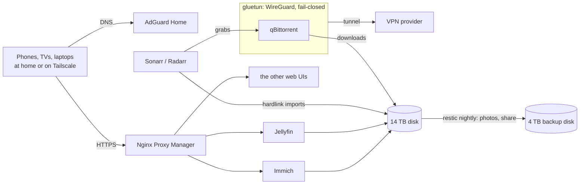

# The server

A second-hand ThinkPad T14s doing the work of a NAS, a media box and a VPN
gateway, on Ubuntu Server 26.04.

## Hardware

| Part | What | Paid |
|---|---|---|
| Server | ThinkPad T14s Gen 1: i5-10310U, 16 GB RAM, 512 GB NVMe, used | $239.99 |
| Media disk | 14 TB 7200 rpm enterprise SATA drive | $309.99 |
| Its enclosure | GODO USB 3.0 bay with its own 12 V supply | $18.99 |
| Backup disk | Seagate Portable 4 TB, already owned | $0 |
| Dock | UGREEN Revodok 10-in-1: Ethernet and both drives on one USB-C cable, with its own 100 W power | $59.99 |

A laptop makes a decent server: low idle power, a built-in screen for
emergencies, and a battery that rides out power blips. The dock has no battery,
so a blip still drops the drives; the recovery steps are written down in the
private repo.

## What it runs

| Service | Job |
|---|---|
| Jellyfin | Streams the library to the TVs and phones |
| Immich | Backs up and organizes phone photos, from its own upstream compose stack |
| Seerr | The household request page: ask for a show and it turns up in Jellyfin |
| Sonarr, Radarr, Prowlarr | Find, download, rename and upgrade TV and movies by quality rules kept in git |
| qBittorrent in gluetun | Downloads run inside a WireGuard VPN container that blocks all traffic the moment the tunnel drops |
| FlareSolverr, decluttarr | Helpers: get searches past Cloudflare checks, and clear failed downloads so they're searched again |
| AdGuard Home | Ad-blocking DNS for every device at home and on the tailnet |
| Nginx Proxy Manager | Real HTTPS on every web UI from one wildcard Let's Encrypt certificate |
| Uptime Kuma, ntfy | 25 monitors, and phone push alerts when a service dies or a scheduled job goes quiet |
| Beszel, Scrutiny | Resource history; drive health graded against Backblaze's failure statistics |
| Homepage, File Browser | One start page for everything; the file share in a browser tab |
| Renovate | Opens a pull request whenever a container image has an update |
| Samba, Tailscale | Run on the host rather than in Docker: the network file share; remote access plus a VPN exit node for my phone |

## Network

- No port forwards, UPnP off, IPv6 internet off at the router. Audits on
  2026-08-23 and 2026-09-06 confirmed nothing answers from outside.
- Remote access goes through Tailscale and nothing else.
- HTTPS certificates are issued over a DNS challenge, so no inbound port ever
  opens.
- The domain's public DNS points at a decoy address. The real one exists only
  in AdGuard's answers, inside the LAN and the tailnet.
- Every web UI is LAN-only and sits behind its own login. SSH takes keys only.

## It keeps itself current

| When | What happens |
|---|---|
| Daily, 05:00 | Renovate checks every image version, opens a pull request per update, and merges most of them itself |
| Daily, 06:00 | The server pulls the compose file from git and restarts only the services whose versions moved. A hand-edited live file blocks the deploy instead of being overwritten |
| Sundays, 04:30 | Ubuntu packages, Docker and Tailscale update unattended, with no automatic reboot. A monitor turns red if anything waits more than 10 days |

Two images never update on their own: gluetun, because it's the kill switch,
and AdGuard, because the whole house's DNS depends on it. Renovate lists their
updates and waits for me.

## Storage and backups

- The 14 TB disk is one ext4 partition mounted by label, and Docker won't start
  until it's mounted. A missing disk means the containers wait instead of
  quietly filling the system drive.
- Downloads and the library share one folder tree, so an import is a hardlink:
  instant, with no second copy.
- Restic runs at 04:00 every night to the 4 TB disk, covering the photos, the
  file share and every service's config. Movies and TV stay single-copy on
  purpose, since they can be downloaded again.
- A restore drill ran on 2026-08-21, the day after the build.

## How it was built

The plan, the floor plan and a runbook were committed on 2026-08-17 and
reviewed before the hardware was set up. Build day was 2026-08-20: thirteen
runbook steps, 19 containers, each piece tested
([how](method.md#prove-it)), and six bugs in the scripts found by running them
([which](case-studies.md#build-day-six-bugs-found-by-running-the-plan)). Over
that night and the next day, 3 TB of existing media moved onto the new disk
while the stack ran. On 2026-08-22 the powered dock replaced the original hub.

The private repo behind all this holds a rebuild runbook that goes from a blank
NVMe to an acceptance checklist, the compose file with per-service notes in
comments, the scripts and timers, and a changelog entry for every release.
